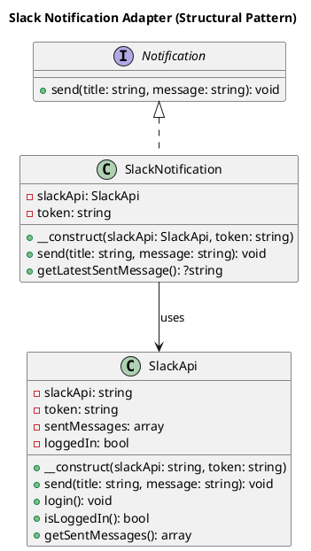

# Slack Notification Adapter

This project demonstrates the **Adapter Design Pattern** in PHP by connecting a generic `Notification` interface to a concrete `SlackApi` implementation — without modifying the original API class.

---

## 🧩 Components

### 🔌 Notification (Interface)

Defines the contract for sending notifications:

```php
interface Notification {
    public function send(string $title, string $message): void;
}
```

---

### 🧱 SlackNotification (Adapter)

Implements `Notification` and internally uses a `SlackApi` instance.

- Strips HTML from messages
- Handles login before sending
- Handles login failures gracefully

---

### ☁️ SlackApi (Adaptee)

Simulates a Slack client:

- Uses a token to simulate login
- Buffers messages in-memory
- Does not perform real HTTP requests (demo/mock)

---

## 🧪 Test Coverage

The PHPUnit test suite covers:

- ✅ Valid and invalid login attempts
- ✅ HTML stripping from messages
- ✅ Sending and storing messages
- ✅ Graceful handling of exceptions
- ✅ Adapter logic (`SlackNotification → SlackApi`)

### Run Tests

```bash
vendor/bin/phpunit tests/
```

---

## 📐 UML Diagram



> 💡 You can render this UML using:
> - [PlantUML Online Editor](https://plantuml.com/plantuml)
> - VS Code with the PlantUML extension

---

## 🎯 Pattern Summary

| Key        | Description                                                                 |
|------------|-----------------------------------------------------------------------------|
| Pattern    | **Adapter**                                                                 |
| Intent     | Convert the interface of a class into one the client expects                |
| Use Case   | Adapt `SlackApi` to a standard `Notification` interface                     |
| Benefit    | Decouples your app logic from the Slack API implementation                  |

---

## 📁 Project Structure

```text
/src
  /Structural
    /Adapter
      Notification.php
      SlackApi.php
      SlackNotification.php
/tests
  SlackNotificationTest.php
```

---

## 📝 Notes

This example is intentionally simple for clarity. In a production setting:

- Replace `SlackApi` with a real HTTP client
- Add a logger or monitoring
- Handle exceptions and tokens securely
- Use Dependency Injection throughout

---
