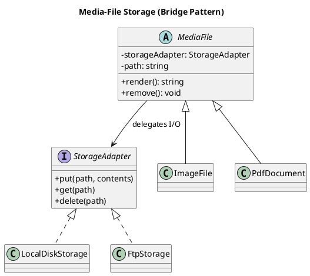

# Media‑File Storage — Bridge Pattern

This project showcases the **Bridge Design Pattern** in PHP by separating *what* a file is (its **abstraction**) from *where/how* its bytes are stored (the **implementor**). Concrete media classes like `ImageFile` and `PdfDocument` rely only on the high‑level `StorageAdapter` interface, allowing you to swap disk, FTP, or cloud storage back‑ends without touching business logic.

---

## 🧩 Components

| Layer           | Class                          | Responsibility                                                    |
| --------------- | ------------------------------ | ----------------------------------------------------------------- |
| **Abstraction** | `MediaFile` *(abstract)*       | Common behaviour for any file‑like asset (rendering & deletion)   |
|                 | `ImageFile` / `PdfDocument`    | Produce HTML output (`` or `<a>`) specific to the media type |
| **Implementor** | `StorageAdapter` *(interface)* | Contract for low‑level persistence (`put / get / delete`)         |
|                 | `LocalDiskStorage`             | Saves bytes to the server’s local filesystem                      |
|                 | `FtpStorage`                   | In‑memory stub that mimics an FTP back‑end — perfect for tests    |

---

## ⚙️ Quick Example

```php
$storage = new LocalDiskStorage();
$storage->put('uploads/kittens.png', $binaryImage);

$img = new ImageFile($storage, 'uploads/kittens.png');

echo $img->render(); // 
```

Swap the storage with zero changes to `ImageFile`:

```php
$ftp = new FtpStorage('ftp.example.com', 'user', 'secret');
$pdf = new PdfDocument($ftp, 'reports/2025-Q2.pdf');

echo $pdf->render(); // <a href="/media/reports/2025-Q2.pdf" target="_blank">Download PDF</a>
```

---

## 🧪 Test Coverage

The PHPUnit suite focuses on storage guarantees while remaining hermetic:

- ✅ *Put ➜ Get* round‑trip with `LocalDiskStorage`
- ✅ Deletion and subsequent read failures
- ✅ Exceptions on missing paths
- ✅ Native I/O calls stubbed with an **in‑memory map** (no real disk access)

Run tests:

```bash
vendor/bin/phpunit Structural/Bridge/Tests
```

---

## 📐 UML Diagram



> 💡 Render the UML with [PlantUML](https://plantuml.com/) or any compatible IDE plugin.

---

## 🎯 Pattern Summary

| Key                  | Description                                                                                                                    |
| -------------------- | ------------------------------------------------------------------------------------------------------------------------------ |
| **Pattern**          | **Bridge**                                                                                                                     |
| **Intent**           | Decouple an abstraction from its implementation so the two can vary independently                                              |
| **Abstraction Side** | `MediaFile` hierarchy decides *how* the file is represented to the outside world                                               |
| **Implementor Side** | `StorageAdapter` and its concretes decide *where* the data lives                                                               |
| **Benefit**          | Swap storage back‑ends (local disk, FTP, S3…) without rewriting media logic; add new media types without touching storage code |

---

## 📁 Project Structure

```text
/src
  /Structural
    /Bridge
      StorageAdapter.php
      LocalDiskStorage.php
      FtpStorage.php
      MediaFile.php
      ImageFile.php
      PdfDocument.php
/tests
  /Structural/Bridge/Tests/BridgeTest.php
```

---

## 📝 Notes & Next Steps

- **Production storage**: Replace `LocalDiskStorage` with an S3, Azure Blob, or GCS adapter.
- **Security**: Sanitize upload paths and enforce MIME checking in real apps.
- **Performance**: Layer caching on top of `StorageAdapter` or batch FTP calls.
- **Dependency Injection**: Wire adapters through a DI container for cleaner config.

Happy bridging! 🚀

