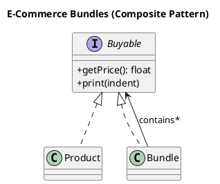

                   # E‑Commerce Bundles — Composite Pattern

This repository demonstrates the **Composite Design Pattern** in PHP through a realistic *e‑commerce* scenario. Individual `Product`s (leaves) and grouped `Bundle`s (composites) share the same `Buyable` interface, allowing the checkout code to treat them uniformly— whether it’s one SKU or a nested gift basket.

---

## 🧩 Components

| Role / Pattern Part | Class / Interface         | Responsibility                                                    |
| ------------------- | ------------------------- | ----------------------------------------------------------------- |
| **Component**       | `Buyable` *(interface)*   | Contract every price‑able item must fulfill (`getPrice`, `print`) |
| **Leaf**            | `Product`                 | Represents a single stock‑keeping unit with a fixed unit price    |
| **Composite**       | `Bundle`                  | Contains any mix of products **and other bundles**, adds discount |
| **Client Demo**     | `CompositeTest` (PHPUnit) | Shows the pattern in action via cart + nested bundles             |

---

## ⚙️ Quick Example

```php
$mouse   = new Product('M100', 'Wireless Mouse', 25.00);
$keyboard= new Product('K200', 'Mechanical Keyboard', 70.00);
$monitor = new Product('D241', '24" IPS Monitor', 150.00);

$starter = new Bundle('Starter Kit', 10);   // –10 %
$starter->add($mouse);
$starter->add($keyboard);

$proDesk = new Bundle('Pro Desk Setup', 15); // –15 %
$proDesk->add($starter);   // nested bundle
$proDesk->add($monitor);

$cartTotal = $proDesk->getPrice(); // 200.18
```

Because both `Product` and `Bundle` implement `Buyable`, client code never needs an `if ($item instanceof Bundle)…` check—it simply calls `getPrice()`.

---

## 🧪 Test Coverage

The \`\` suite verifies:

- ✅ Leaf price is returned verbatim (`Product`)
- ✅ Composite price equals sum of children when no discount (`Bundle`)
- ✅ Percentage discounts are applied and *rounded to 2 decimals*
- ✅ Deeply nested bundles cascade discounts correctly
- ✅ Pretty‑print output includes proper indentation for hierarchy

Run tests:

```bash
vendor/bin/phpunit Structural/Composite/CompositeTest.php
```

---

## 📐 UML Diagram



> 💡 Render with [PlantUML](https://plantuml.com/) or an IDE plugin.

---

## 🎯 Pattern Summary

| Aspect         | Detail                                                                                                      |
| -------------- | ----------------------------------------------------------------------------------------------------------- |
| **Pattern**    | **Composite**                                                                                               |
| **Intent**     | Compose objects into tree structures to represent part‑whole hierarchies; let clients treat parts uniformly |
| **Leaves**     | `Product` – atomic, no children                                                                             |
| **Composites** | `Bundle` – holds any `Buyable`, aggregates prices, applies discount                                         |
| **Benefit**    | Add new item types (e.g., `Subscription`) or pricing rules without changing checkout logic                  |

---

## 📁 Project Structure

```text
/src
  /Structural
    /Composite
      Buyable.php
      Product.php
      Bundle.php
/tests
  /Structural/Composite/CompositeTest.php
```

---

## 📝 Notes & Ideas

- **VAT / Tax**: Extend `Buyable` with `getTaxInclusivePrice()` if you need gross prices.
- **Multiple Discounts**: Replace the single `%` with a strategy object to support tiered promos.
- **Internationalisation**: Localise currency formatting rather than hard‑coding the euro sign.

Happy compositing! 🎉

