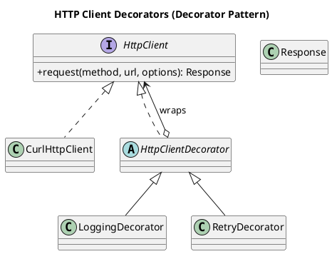

# HTTP Client Decorators — Decorator Pattern

This repository showcases the **Decorator Design Pattern** in PHP with a realistic *HTTP-client* scenario.  
A bare-bones `CurlHttpClient` is transparently wrapped by decorators that add **logging** and **automatic retries** without changing the original transport code.

---

## 🧩 Components

| Role / Pattern Part | Class / Interface              | Responsibility                                                         |
| ------------------- | ------------------------------ | ---------------------------------------------------------------------- |
| **Component**       | `HttpClient` *(interface)*     | Contract for *any* synchronous client (`request`)                      |
| **Concrete Component** | `CurlHttpClient`            | Sends the real request (prints here, but cURL in prod)                 |
| **Base Decorator**  | `HttpClientDecorator`          | Forwards every call to an inner client                                 |
| **Concrete Decorator** | `LoggingDecorator`          | Logs method, URL, status & latency for each call                       |
| **Concrete Decorator** | `RetryDecorator`            | Retries transient 5xx responses with exponential back-off              |
| **Client Demo**     | PHPUnit tests (`ClientExampleTest`) | Shows stacking: `Retry → Log → Curl`                                   |

---

## ⚙️ Quick Example

```php
use DesignPatterns\Structural\Decorator\{
    RetryDecorator,
    LoggingDecorator,
    CurlHttpClient
};

$client = new RetryDecorator(
    new LoggingDecorator(
        new CurlHttpClient()
    ),
    maxAttempts: 4          // try up to 4 times
);

echo "---- Performing GET /api/stats ----\n";
$response = $client->request('GET', 'https://example.com/api/stats');

echo "Final status: {$response->statusCode}\n";
// Sample output:
// ---- Performing GET /api/stats ----
// CURL → GET https://example.com/api/stats …
// [500] GET https://example.com/api/stats (3.2ms)
// Retry in 100 ms (attempt 1)…
// ...
// [200] GET https://example.com/api/stats (2.1ms)
// Final status: 200
```

Because both decorators honour the `HttpClient` interface, you can **stack, mix, or remove** them at runtime—no `if ($client instanceof RetryDecorator)` needed.

---

## 🧪 Test Coverage

The PHPUnit suite verifies:

- ✅ `LoggingDecorator` forwards and logs exactly once.
- ✅ `RetryDecorator` retries on 5xx and succeeds within the limit.
- ✅ It stops after `maxAttempts` and **does not** retry on 4xx.
- ✅ The published snippet (`ClientExampleTest`) never exceeds 4 attempts.

Run tests:

```bash
vendor/bin/phpunit tests/Structural/Decorator
```

---

## 📐 UML Diagram



> 💡 Render with [PlantUML](https://plantuml.com/) or an IDE plugin.

---

## 🎯 Pattern Summary

| Aspect        | Detail                                                                                         |
| ------------- | ---------------------------------------------------------------------------------------------- |
| **Pattern**   | **Decorator**                                                                                  |
| **Intent**    | Attach additional responsibilities to an object dynamically, keeping the same interface.       |
| **Component** | `HttpClient` – the abstraction clients depend on                                               |
| **Concrete**  | `CurlHttpClient` – does the real work                                                          |
| **Decorators**| `LoggingDecorator`, `RetryDecorator` – add *cross-cutting* behaviour                            |
| **Benefit**   | Combine or swap concerns (caching, auth, metrics, …) without altering or subclassing the core  |

---

## 📁 Project Structure

```text
/src
  /Structural
    /Decorator
      HttpClient.php
      Response.php
      CurlHttpClient.php
      HttpClientDecorator.php
      LoggingDecorator.php
      RetryDecorator.php
/tests
  /Structural/Decorator
    ClientExampleTest.php
    HttpClientDecoratorTest.php
```

---

## 📝 Notes & Ideas

- **Caching**: Add a `CacheDecorator` that stores responses by URL + params.
- **Authentication**: A `BearerTokenDecorator` could inject OAuth headers.
- **Rate-Limiting**: Throttle via a `RateLimitDecorator` to respect API quotas.
- **Async**: Swap `CurlHttpClient` for an async implementation—the decorators stay the same.

Happy decorating! 🎉
